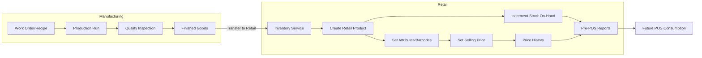

# Retail Module Plan and Workflow

This document defines a practical, phased plan to enable retail operations before building the POS. It covers: product availability from manufacturing, product creation in retail, price management, stock visibility, and pre‑POS reporting. Diagrams are provided using Mermaid.

## Objectives
- Ensure products exist in Retail (converted from Manufacturing outputs) with correct stock and attributes.
- Enable Product/Retail Manager to set and maintain selling prices (initial and from history).
- Provide visibility of on‑hand stock and low‑stock alerts.
- Deliver basic sales/stock reports prior to POS rollout.
- Prepare clean interfaces so the future POS can consume products, prices, and stock with minimal work.

## End‑to‑End Workflow (High Level)


## Detailed Process Steps
1) Manufacturing completes a production run; items pass quality inspection and become Finished Goods.
2) Finished Goods are transferred into Retail inventory (SKU/Variant/Batch as needed).
3) Retail Product is created or matched:
   - If SKU exists, increment stock; else create product record and then increment stock.
4) Product Manager sets selling price:
   - If prior price exists, suggest previous price (and margin guidance if cost is known).
   - If no history, set initial price; persist to price history with effective date.
5) Pre‑POS Reporting available immediately:
   - Stock on hand, low‑stock list, product catalog with current price, yesterday’s sales (once POS exists).
6) POS (later) consumes the same product+price endpoints to sell and decrement stock; posts GL via existing accounting flows.

## Domain Model (Retail)
```mermaid
erDiagram
  PRODUCT ||--o{ VARIANT : has
  PRODUCT {
    int ProductID PK
    string SKU unique
    string Name
    string Category
    bool IsActive
  }
  VARIANT {
    int VariantID PK
    int ProductID FK
    string Barcode unique
    string AttributesJson
  }
  PRICE ||--|| PRODUCT : for
  PRICE {
    int PriceID PK
    int ProductID FK
    decimal SellingPrice
    date EffectiveFrom
    date EffectiveTo nullable
    string Currency
  }
  STOCK ||--|| VARIANT : for
  STOCK {
    int StockID PK
    int VariantID FK
    decimal QtyOnHand
    decimal ReorderPoint
    string Location
    datetime UpdatedAt
  }
  SALES ||--|| VARIANT : of
  SALES {
    int SalesID PK
    int VariantID FK
    decimal Qty
    decimal UnitPrice
    datetime SalesDate
    int Channel  -- e.g., POS, Online
  }
```

Notes:
- If you do not use variants, merge `VARIANT` into `PRODUCT` and move `Barcode`/attributes up.
- `PRICE` is a history table (SCD Type 2–style) with 1 active row per product (EffectiveTo NULL).

## Sequence: Manufacturing to Retail
```mermaid
sequenceDiagram
  participant M as Manufacturing
  participant Inv as Inventory Service
  participant R as Retail Catalog
  participant PM as Product Manager

  M->>Inv: Transfer finished goods (SKU, qty, batch)
  Inv->>R: Upsert Product/Variant; +Stock
  R-->>Inv: ProductID/VariantID
  PM->>R: Set/Confirm SellingPrice
  R-->>PM: PriceHistory updated; Active price set
```

## Pre‑POS Reports (Minimum)
- Stock On Hand by Product/Variant, with ReorderPoint and Low‑Stock flag.
- Product Catalog with Current Price, Category, Barcode.
- Price History for audit and margin review.
- Daily Sales Summary (available once POS is active).

## Low‑Stock Logic
- LowStock = `QtyOnHand <= ReorderPoint`.
- Highlight in UI; optional email/notification hooks later.

## API/Service Endpoints (proposed)
- POST `/retail/products/upsert`
  - Body: SKU, Name, Category, Barcode(s), Attributes, ReorderPoint
  - Behavior: Create if missing; otherwise update base info.
- POST `/retail/stock/adjust`
  - Body: SKU or VariantID, QtyDelta, Reason (Production, Correction)
  - Behavior: Adds to on‑hand; writes stock movement log.
- POST `/retail/prices/set`
  - Body: ProductID, SellingPrice, Currency, EffectiveFrom
  - Behavior: Closes prior active price; inserts new active price.
- GET `/retail/stock/low` → low‑stock list
- GET `/retail/products` → catalog with prices

These can be implemented as internal service methods in the WinForms/ADO.NET stack right now; REST endpoints are listed for clarity and possible future services.

## GL Integration (already prepared)
- Sales will post via AR flows once POS is live.
- COGS/Inventory movements follow the Inventory→COGS flows defined in your Accounting postings.

## Phased Roadmap
- Phase 0 — Data Model + Scripts
  - Create tables: Product, Variant (optional), Price (history), Stock, StockMovements.
  - Views: v_StockOnHand, v_LowStock, v_ProductCatalogCurrentPrice, v_PriceHistory.
- Phase 1 — Retail Admin (pre‑POS)
  - Screens: Product Upsert, Price Management, Stock View + Low‑Stock.
  - Import: from Manufacturing transfer (service) to Retail stock.
- Phase 2 — Reporting
  - Low‑Stock report, Product/Price exports, Daily Sales stub (awaiting POS).
- Phase 3 — POS Foundation
  - POS product browse/scan, price lookup, cart, tendering stubs.
  - Post sales journals using existing GL procedures.
- Phase 4 — POS Completion
  - Discounts, returns, end‑of‑day, cash-up, Z-read, receipt printing.

## Dependencies & Assumptions
- Manufacturing emits SKU/Qty (and optionally batch/lot) at finish.
- Accounting module is in place for sales postings.
- Azure SQL (latest) supports window functions and our idempotent scripts.

## Risks & Mitigations
- Missing barcodes → Provide quick barcode assignment during product upsert.
- Price gaps → Enforce exactly one active price; validate effective dates.
- Stock mismatches → Keep StockMovements log for audit and corrections.

## Next Steps (Actionable)
1) Create Retail DB scripts (tables + views) in `Database/Retail/` (idempotent).
2) Build WinForms screens for:
   - Product Upsert (SKU, Name, Barcode, Category, ReorderPoint, Active Price).
   - Price Management (history view + new price wizard).
   - Stock Overview with Low‑Stock filter.
3) Add Inventory→Retail transfer service method that upserts product and adjusts stock.
4) Add reports: Low Stock, Product Catalog with Current Price, Price History.
5) Only then start POS foundation (Phase 3) against the same product/price/stock sources.
